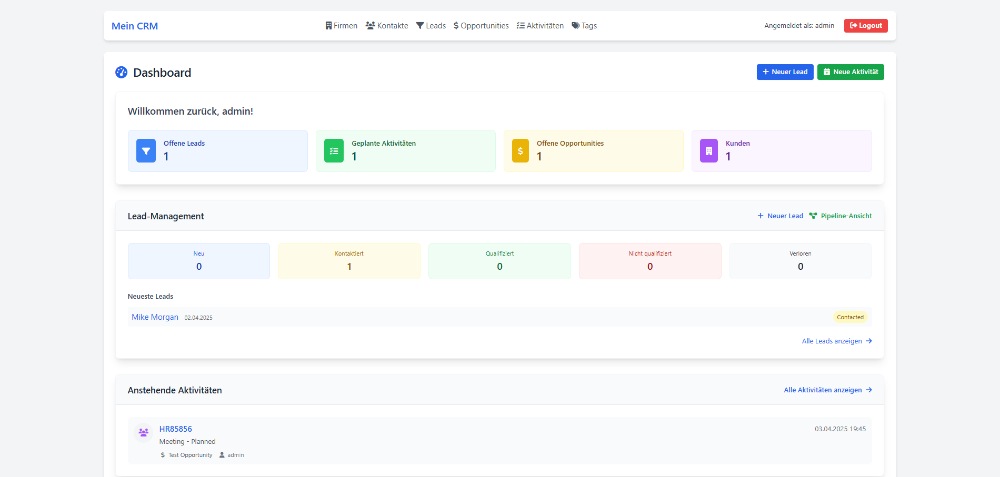
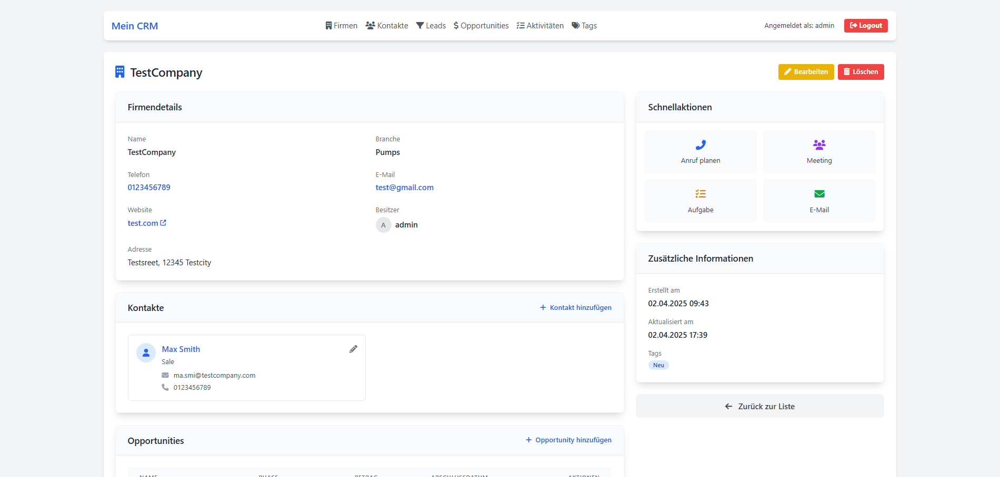
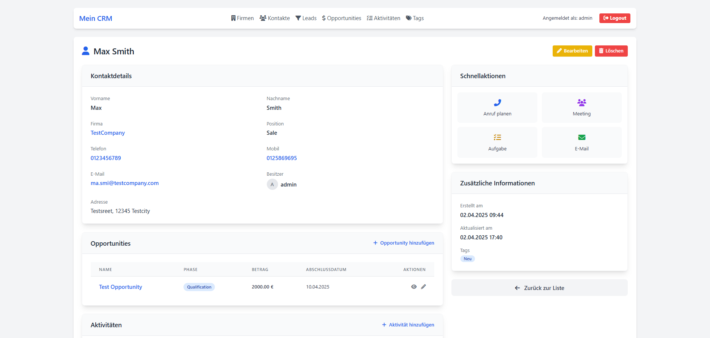
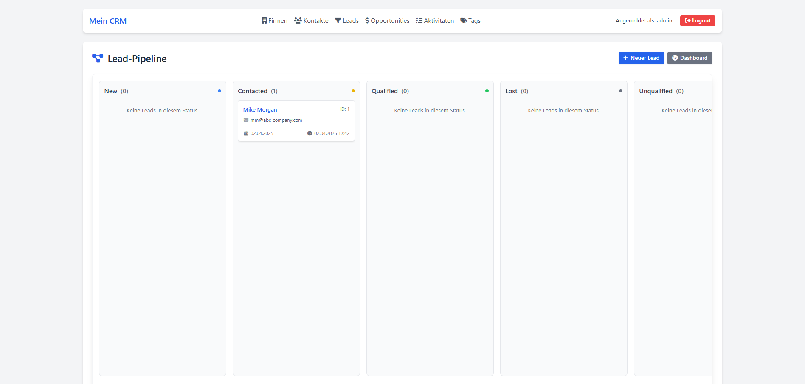

# Django CRM

## Overview

This Django CRM (Customer Relationship Management) project is still in the early stages of development. It is being developed as a platform for managing customer relationships.

## Project Description

The Django CRM aims to provide a user-friendly interface for managing customer data, tracking interactions, and optimizing the sales process. The project uses the Django framework for a robust and scalable web application.

**Note:** The project is currently in German, but multilingual support is planned for future releases.

## Features

### Already Integrated:
- USER / GROUP: User management and authentication
- LEAD: Prospect management
- ACCOUNT: Company/organization management
- CONTACT: Individual contact management
- OPPORTUNITY: Sales opportunity tracking
- ACTIVITY: Interaction logging

### Planned:
- PRODUCT: Product catalog management
- QUOTE / QUOTE_LINE_ITEM: Quote generation and management
- OPPORTUNITY_PRODUCT: Product association with opportunities
- CAMPAIGN: Marketing campaign management
- CASE: Customer support case management
- TAG system for flexible categorization
- NOTE / ATTACHMENT: Document management
- Task and appointment scheduling
- Reporting and analytics
- Advanced permission system
- Multilingual support

## Screenshots

### Dashboard


### Customer Management


### Contact Management


### Sales Pipeline


## Technologies

- Python
- Django
- HTML/CSS
- JavaScript
- SQLite (development) / PostgreSQL (production)

## Installation

1. Clone the repository:
```bash
git clone https://github.com/Iam-Sanja/django_crm.git
```

2. Change to the project directory:
```bash
cd django_crm
```

3. Activate the virtual environment:
```bash
venv\Scripts\activate
```

4. Install dependencies:
```bash
pip install -r requirements.txt
```

5. Run database migrations:
```bash
python manage.py migrate
```

6. Create a superuser to access the admin interface:
```bash
python manage.py createsuperuser
```

7. Start the development server:
```bash
python manage.py runserver
```

8. Access the application at http://127.0.0.1:8000/ and the admin interface at http://127.0.0.1:8000/admin/

## Project Status

This project is in the early development phase. Many features are still in planning or development.

## Contributing

Contributions to the project are welcome! If you want to contribute:

1. Fork the repository
2. Create a feature branch (`git checkout -b feature/AmazingFeature`)
3. Commit your changes (`git commit -m 'Add some AmazingFeature'`)
4. Push the branch (`git push origin feature/AmazingFeature`)
5. Open a Pull Request

## License

[MIT License](LICENSE)

## Contact

Alex Granson - contact@a-git.de

Project Link: [https://github.com/Iam-Sanja/django_crm](https://github.com/Iam-Sanja/django_crm)

---

*Note: This README will be updated as the project develops.*
